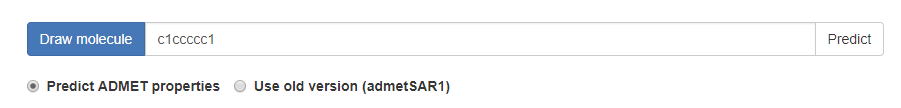
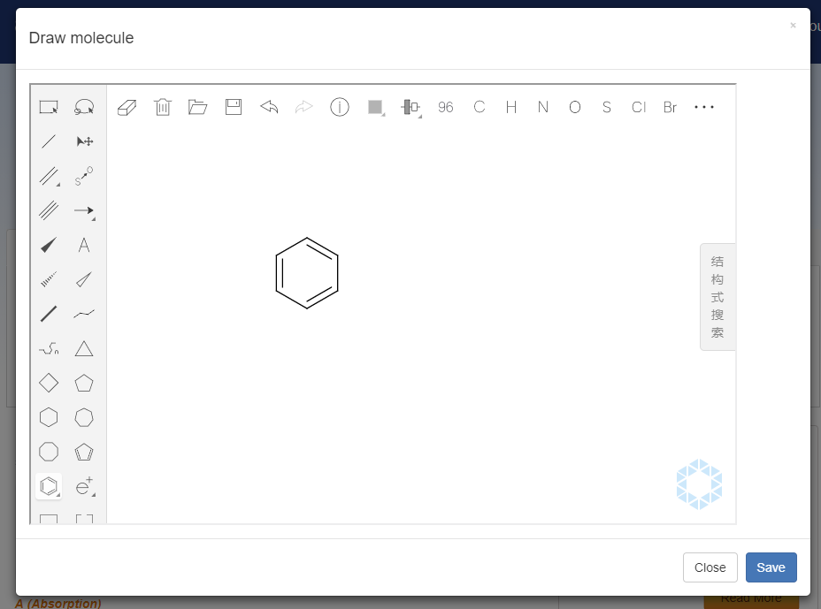
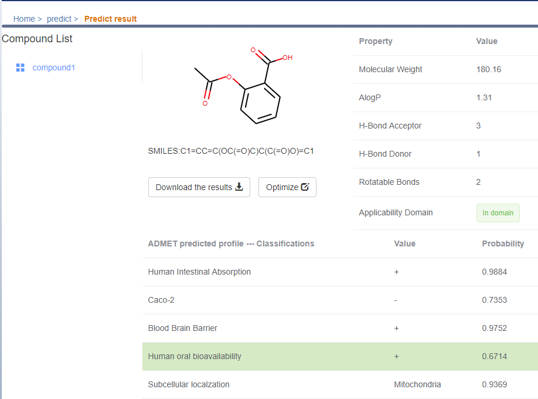
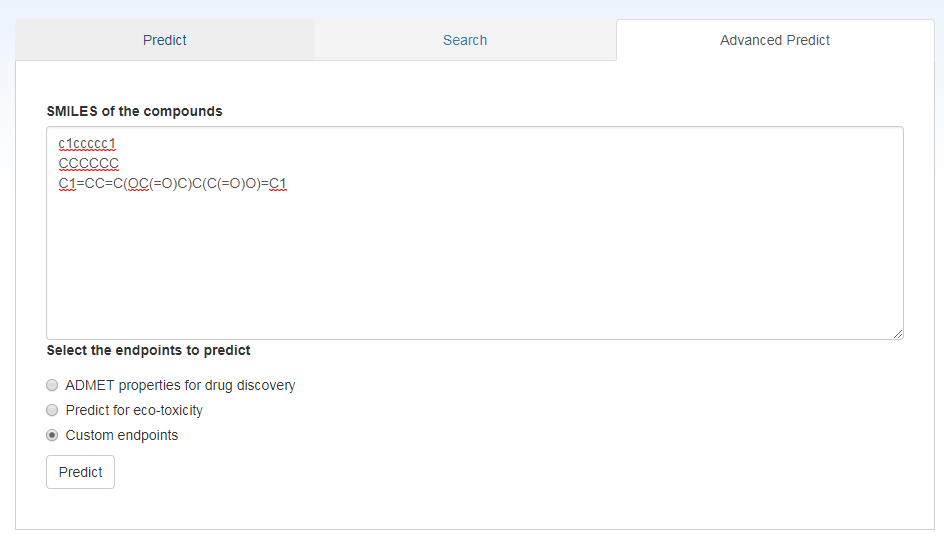
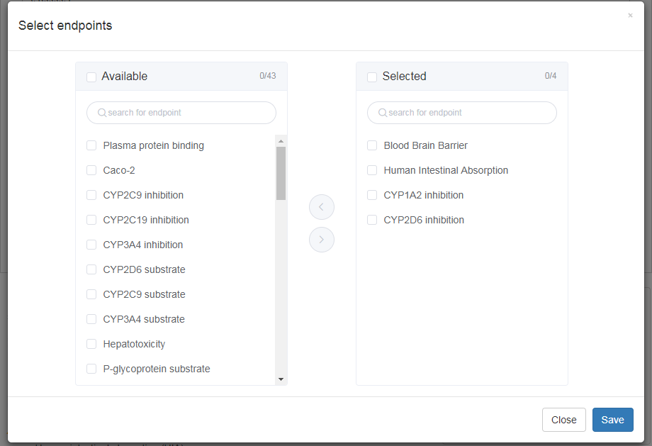
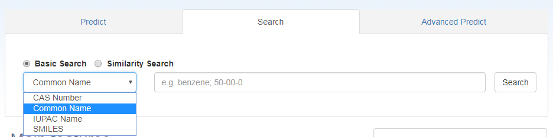
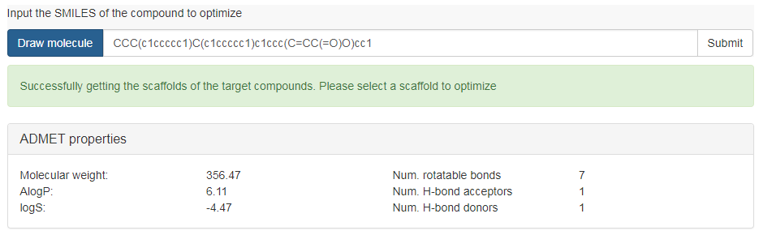
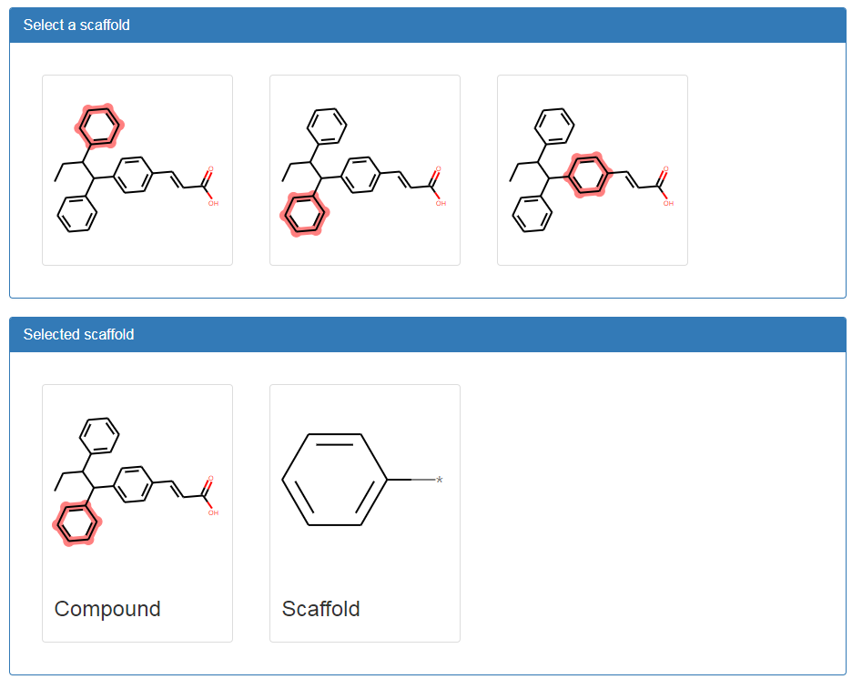
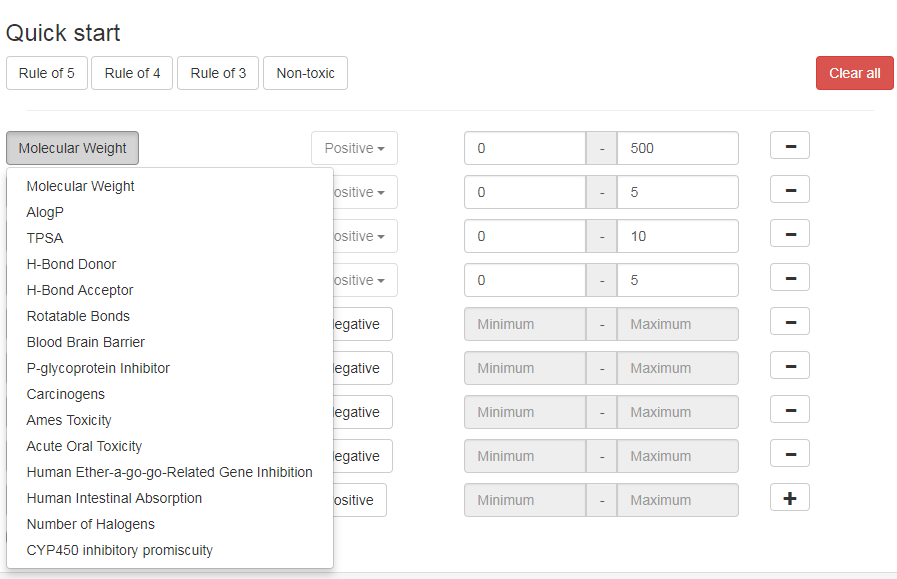

<title>Guide for use of admetSAR 2 </title>

<center><a class="title">Guide for use of admetSAR 2</a></center>

[TOC]

## Introduction

admetSAR creates a user-friendly interface to search for ADME/T (Absorption, Distribution, Metabolism, Excretion, and Toxicity) properties profiling by name, CASRN and similarity search. The new version of admetSAR mainly focuses on *in silico* prediction of chemical ADMET properties. More than 40 high predictive models were implemented in admetSAR for new chemical ADMET properties *in silico* filtering. These models are trianed by state-of-the-art machine learning methods including Suport Vector Mahine, k-Nearest Neighbors, nueral network, etc.

admetSAR 2 is available in: [http://lmmd.ecust.edu.cn/admetsar2](http://lmmd.ecust.edu.cn/admetsar2)

## Prediction of ADMET properties

### Quickstart

The webserver is easy to use. Input the SMILSE of the query molecule or draw that molecule, and then predict its ADMET properties.

#### Input

The query molecule should be represented as [SMILES](http://www.daylight.com/dayhtml/doc/theory/theory.smiles.html).
For example, *figure 1* shows the SMILES of benzene. The user can also draw the structure of the query molecule by click "Draw molecule", and a structure editor will shown (*figure 2*). After the structure is drawn, click "save" and the SMILES of the molecule will automatically display in the inputbox.

  
<center>Figure 1</center>

  
<center>Figure 2</center>

#### Predict

After the molecule is correctly input, click "Predict" to submit the job (*figure 1*) and a successful message will display that provide the task id the url to get the result (*figure 3*). You don't need to manually click the link since the page will automatically turn to that page once the task is completed.

  
<center>Figure 3</center>

#### Results
The *figure 4* shows the result page of ADMET prediction.
The left part is the compound list. When more than one compound is submitted (see *Advanced Prediction* for details), they will be listed as "compound1", "compound2"... under the same order as the user input.
The right part is the properties of the selected compound, including the structure, SMILES, physicochemical properties and the predictive ADMET properties.

You can download all the results as a csv file by clicking the "Download the results" button below the SMILES. You can also optimize it with ADMETopt by clicking the "Optimize" button beside.



The ADMET property table includes classification and regression results. For classification, the columns of the table are endpoint, value and probability, respectively. The value is the predict labels. For example, for toxicity endpoints, the value "+" means Positive/Toxic while "-" means Negative/Nontoxic. The probability is related to the value, so it is mostly higher than 50% since most machine learning models use 50% as a threshold to distinguish positive or negative results.

### Advanced prediction

Advanced prediction allows the user to predict more than one molecule in a batch and select custom endpoints the user is interested in.

Before prediction, the you should prepare your molecules by representing them as SMILES. You can either use softwares like ChemDraw or use the built-in drawing widget mentioned in Quickstart. Then paste the SMILES of the molecules into the textbox and keep each molecule in one line. e.g.

```bash
c1ccccc1
CCCCCC
C1=CC=C(OC(=O)C)C(C(=O)O)=C1
```

  
<center>Figure 5</center>

Click "Advanced Predict" in the home page and copy the SMILES of the molecules you want to predict to the textbox (*figure 5*). Then you should select the endpoints you want to predict.
We have predefined two sets of endpoint, i.e. "ADMET properties for drug discovery" and "Predict for eco-toxicity". You can also select "Custom endpoint". Then a endpoint selection page will display and you can select the endpoints you interested (*figure 6*). At most **20** endpoints can be selected.

  
<center>Figure 6</center>

## Search compounds

The new version of admetSAR do not update the database for search. Instead, we added a wrapper to redirect the search to the [admetSAR1](http://lmmd.ecust.edu.cn/admetsar1).

As shown in *figure 7*, you can search for a compound by CAS number, common name, IUPAC name or SMILES. To avoid subtle difference leading to empty result, we suggest to use similarity search instead of directly using SMILES.


<center>Figure 7</center>

## Guide for ADMETopt

ADMETopt is available at: [http://lmmd.ecust.edu.cn/admetsar2/admetopt/](http://lmmd.ecust.edu.cn/admetsar2/admetopt/).
You can also click "Optimize" at the nevigation bar in [admetSAR](http://lmmd.ecust.edu.cn/admetsar2).

### Quickstart

#### Input molecule

Similar with predicting ADMET properties, the first thing is to prepare the SMILES of the query molecule. You can also draw the structure of the query molecule by click "Draw molecule". After you input the SMILES of the query molecule, click "submit" to get all the scaffold available. You will see the basic chemical properties of the molecule, including molecular weight, AlogP, logS, number of H-bond donors and acceptors, and number of rotatable bonds.


<center>Figure 8</center>

#### Select a scaffold

In addition to the basic properties of the molecule, you will see all possible scaffolds available for optimization. Select the scaffold you want to replace and check it again (*figure 9*).


<center>Figure 9</center>

#### Set constraints
In total 15 constraints can be set to optimize the properties of the query compound. You can add or remove the constraints by click "+" or "-" at the right of each constrain. For binary endpoints, such as Ames toxicity, blood brain barrier, select the "Positive/Negative" botton to set the goal of optimization. For continue endpoints such as molecular weight, input the range of your goal such as 0 and 500 as minimum and maximum. You can also add the predefined rules below "Quick start", which are "Rule of 5", "Rule of 4", "Rule of 3", and "Non toxic". It should be noticed that if there are two constaints with the same endpoint, one of them will be omitted. After you set all the constraints, click "submit" to run the job.


<center>Figure 10</center>

### Results and analysis
