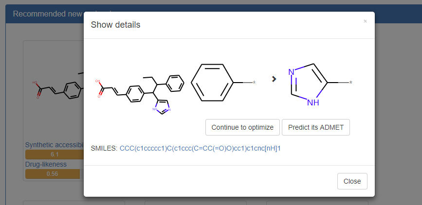

<title>User Guide for admetSAR 2.0</title>

<center><a class="title">User Guide for admetSAR 2.0</a></center>

[TOC]

## 1. Introduction

admetSAR creates a user-friendly interface to search for ADME/T (Absorption, Distribution, Metabolism, Excretion, and Toxicity) properties profiling by name, CASRN and similarity search. The new version of admetSAR mainly focuses on *in silico* prediction of chemical ADMET properties. More than 40 predictive models were implemented in admetSAR for new chemical ADMET properties *in silico* filtering. These models are trained by state-of-the-art machine learning methods including support vector machine, k-nearest neighbors, neural network, etc.

admetSAR 2 is available in: [http://lmmd.ecust.edu.cn/admetsar2](http://lmmd.ecust.edu.cn/admetsar2)

## 2. Prediction of ADMET properties

### 2.1 Quickstart

The webserver is easy to use. Input the SMILES of the query molecule or draw that molecule, and then predict its ADMET properties.

#### Input

The query molecule should be represented as [SMILES](http://www.daylight.com/dayhtml/doc/theory/theory.smiles.html).
For example, *Figure 1* shows the SMILES of benzene. The user can also draw the structure of the query molecule by click "Draw molecule", and a structure editor will show (*Figure 2*). After the structure is drawn, click "save" and the SMILES of the molecule will automatically display in the inputbox.

<center>
  
Figure 1. An example of input SMIELS
</center>

<center>
  
Figure 2. The user interface of the structure editor
</center>

#### Predict

After the molecule is correctly input, click "Predict" to submit the job (*Figure 1*) and a successful message will display that provide the task id the url address accessing to the results (*Figure 3*). Without the need to click the link, the result page will pop out automatically once the task is completed.

<center>
  
Figure 3. Message after submitting a job
</center>

#### Results
The *Figure 4* shows the result page of ADMET prediction.
The left part is the compound list. When more than one compound is submitted (see *Advanced Prediction* for details), they will be listed as "compound1", "compound2"... with the same order as the user input.
The right part is the properties of the selected compound, including the structure, SMILES, physicochemical properties and the predictive ADMET properties.

You can download all the results as a csv file by clicking the "Download the results" button below the SMILES. You can also optimize it with ADMETopt by clicking the "Optimize" button beside.

<center>
  
Figure 4. Result page of ADMET prediction
</center>

The ADMET property table includes classification and regression results. For classification, the columns of the table are endpoint, value and probability, respectively. The value is the predict labels. For example, for toxicity endpoints, the value "+" means Positive/Toxic while "-" means Negative/Nontoxic. The probability is related to the value, and it is generally higher than 50% becuase if the probability was less than 50%, it should have been predicted as the other result. For the regression models, the columns are endpoint, value and unit.

### 2.2 Advanced prediction

Advanced prediction allows the user to predict molecules in batch and to custom endpoints that they are interested in.

Before prediction, you should prepare your molecules by representing them as SMILES. You can either use softwares like ChemDraw or use the built-in drawing widget mentioned in Quickstart. Then paste the SMILES of the molecules into the textbox and keep each molecule in one line (*Figure 5*), e.g.:

```bash
c1ccccc1
CCCCCC
C1=CC=C(OC(=O)C)C(C(=O)O)=C1
```

<center>
  
Figure 5. Entrance for advanced prediction
</center>

Click "Advanced Predict" in the home page and copy the SMILES of the molecules you want to predict to the textbox (*Figure 5*). Then you should select the endpoints you want to predict.
We have predefined two sets of endpoint, i.e. "ADMET properties for drug discovery" and "Predict for eco-toxicity". You can also select "Custom endpoint"and then a endpoint selection page will display and you can select the endpoints you interested in (*Figure 6*). At most **20** endpoints can be selected.

<center>
  
Figure 6. Selection of custom endpoints
</center>

## 3. Search compounds

The new version of admetSAR do not update the database for search. Instead, we added a wrapper to redirect the search to the [admetSAR1](http://lmmd.ecust.edu.cn/admetsar1).

As shown in *Figure 7*, you can search for a compound by CAS number, common name, IUPAC name or SMILES. To avoid subtle difference leading to empty result, we suggest to use similarity search instead of directly using SMILES.

<center>
  
Figure 7. Entrance for compound searching.
</center>

## 4. Guide for ADMETopt

ADMETopt is available at: [http://lmmd.ecust.edu.cn/admetsar2/admetopt/](http://lmmd.ecust.edu.cn/admetsar2/admetopt/).
You can also click "Optimize" at the navigation bar in [admetSAR](http://lmmd.ecust.edu.cn/admetsar2).

### 4.1 Quickstart

#### Input molecule

Similar with predicting ADMET properties, the first thing is to prepare the SMILES of the query molecule. You can also draw the structure of the query molecule by click "Draw molecule". After you input the SMILES of the query molecule, click "Submit" to get all the scaffold available. You will see the basic chemical properties of the molecule, including molecular weight, AlogP, logS, number of H-bond donors and acceptors, and number of rotatable bonds (*Figure 8*).

<center>
  
Figure 8. Input SMILES in ADMETopt
</center>

#### Select a scaffold

In addition to the basic properties of the molecule, you will see all possible scaffolds available for optimization. Select the scaffold you want to replace and check it again (*Figure 9*).

<center>
  
Figure 9. Selection of molecular scaffold
</center>

#### Set constraints
In total 15 constraints can be set to optimize the properties of the query compound.
You can add or remove the constraints by clicking "+" or "-" at the right of each constraint.
For binary endpoints, such as Ames toxicity, blood brain barrier, select the "Positive/Negative" button to set the goal of optimization.
For continue endpoints such as molecular weight, input the range of your goal such as 0 and 500 as minimum and maximum.
You can also add the predefined rules below "Quick start", which are "Rule of 5", "Rule of 4", "Rule of 3", and "Non toxic" (*Figure 10*).
It should be noticed that if there are two constraints with the same endpoint, one of them will be omitted. After you set all the constraints, click "Submit" to run the job.

<center>
  
Figure 10. Constraints for optimization
</center>

### 4.2 Results and analysis
After about 10 seconds (depending on the query compounds and constraints), the results will display in the page. All of the recommended structures fulfill the constraints you required. Click the structure you interested to see the details (*Figure 11*). Then you can chose to continue to optimize or predict its ADMET properties.

<center>
  
Figure 11. Details of the optimized structure
</center>
